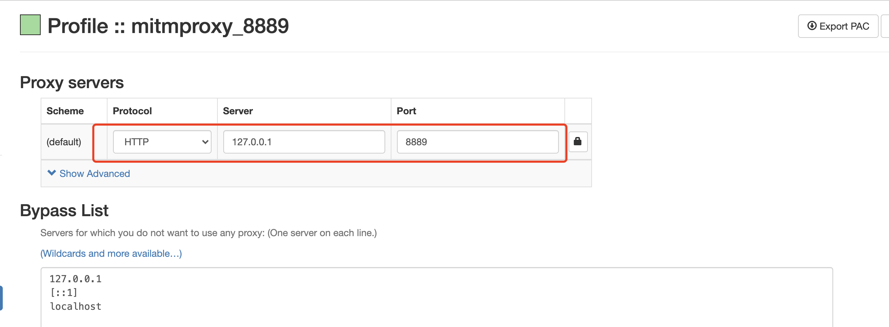
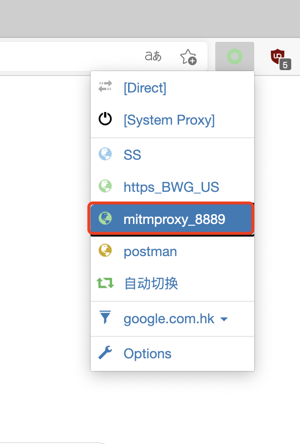
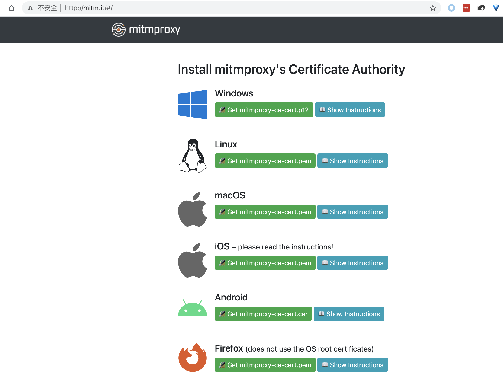

#  Record http api data via mitmproxy tool

# 1.Introduction for mitmproxy

mitmproxy is a set of tools that provide an interactive, SSL/TLS-capable intercepting proxy for HTTP/1, HTTP/2, and WebSockets.  
more details: [https://mitmproxy.org/](website)

# 2.Installation
First, you need to install python3, and the version needs to be at least 3.6.  
Second, for windows and MacOS, run the follow command to install mitmproxy.
```
pip3 install mitmproxy
```
BTW: If an error reported during installation on Windows “AttributeError: module ‘asyncio’ has no attribute ‘WindowsSelectorEventLoopPolicy’”, please try to run ``pip3 install mitmproxy==5.0.1``, it works in my Win10.  
After the installation, you need to test whether the installation is successful. run command:
```
mitmdump --version
```
You should see an output similar to this:
```
Mitmproxy: 10.0.0
Python:    3.11.2
OpenSSL:   OpenSSL 3.0.8 7 Feb 2023
Platform:  Windows-10-10.0.25926-SP0
```

# 3.Run mitmdump
```
mitmdump -p 8889
```

# 4.Configuring Browser Proxy
Probably the most convenient way is install Proxy extension [“SwitchyOmega”](https://chrome.google.com/webstore/detail/proxy-switchyomega/padekgcemlokbadohgkifijomclgjgif).  
Open SwitchyOmega’s options page and create a new proxy profile like this, the port number should be the same as in the previous start command.  

For the final step, click on the "SwitchyOmega" icon and choose your newly configured proxy.  


# 5.Install mitmproxy's Certificate
Start mitmproxy and configure brower with the correct proxy settings, now visit [mitm.it](http://mitm.it/), You should see something like this:  
  
Click on the relevant icon, follow the setup instructions for the platform you’re on.

# 6.Capture & record requests
1.  Edit the [record_http_api.py](record_http_api.py), mainly to configure listening port and the filters that need to be captured, such domains/urls,  request method, response status code, etc. Then start your script with command
   ```
   python3 record_http_api.py
   ```
2. In Chrome browser,  choose your proxy configured and surfing web, the api involved will be automatically recorded to *.csv file in the specified directory. 
